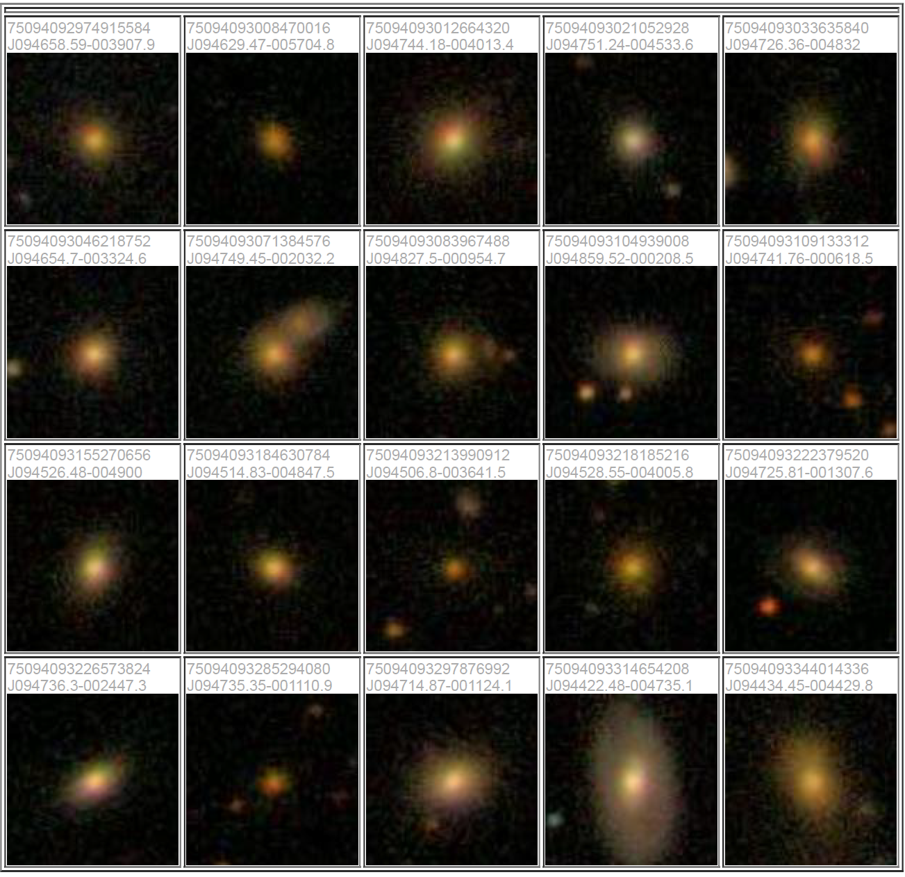
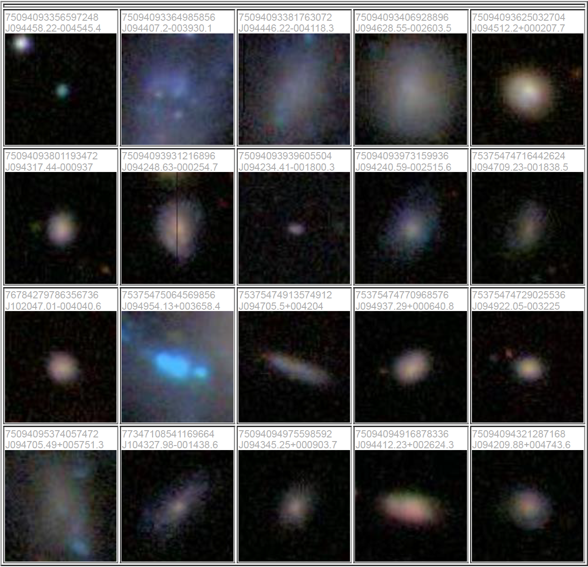
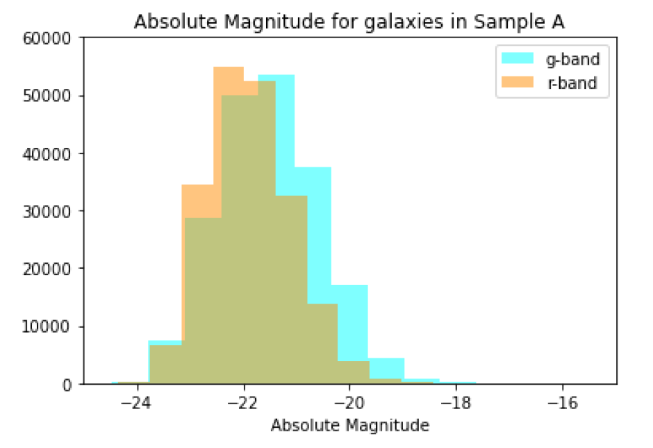
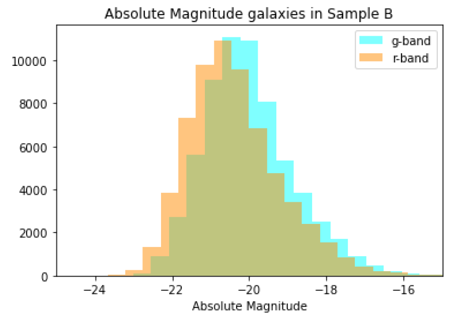
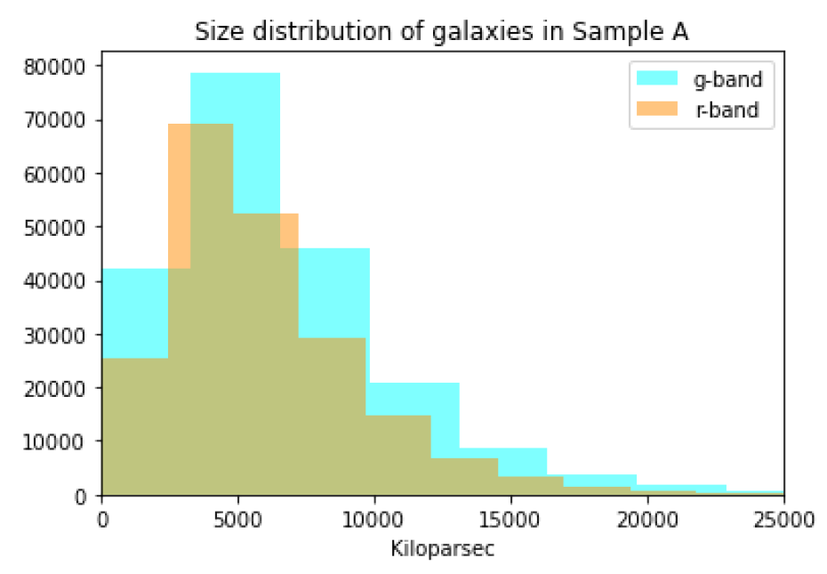
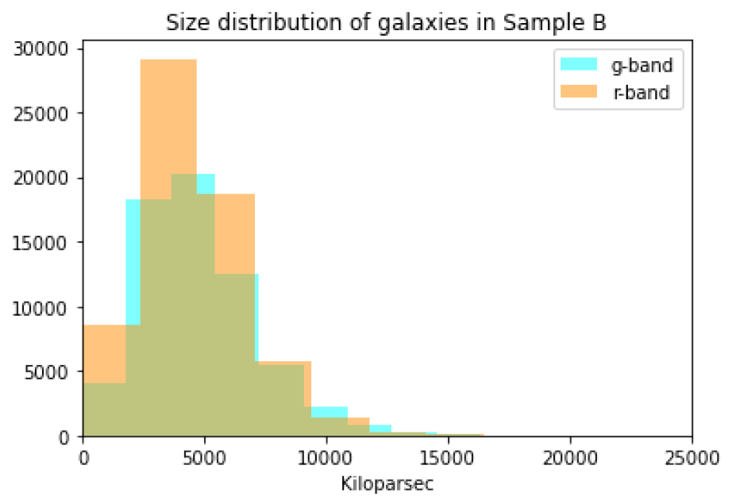
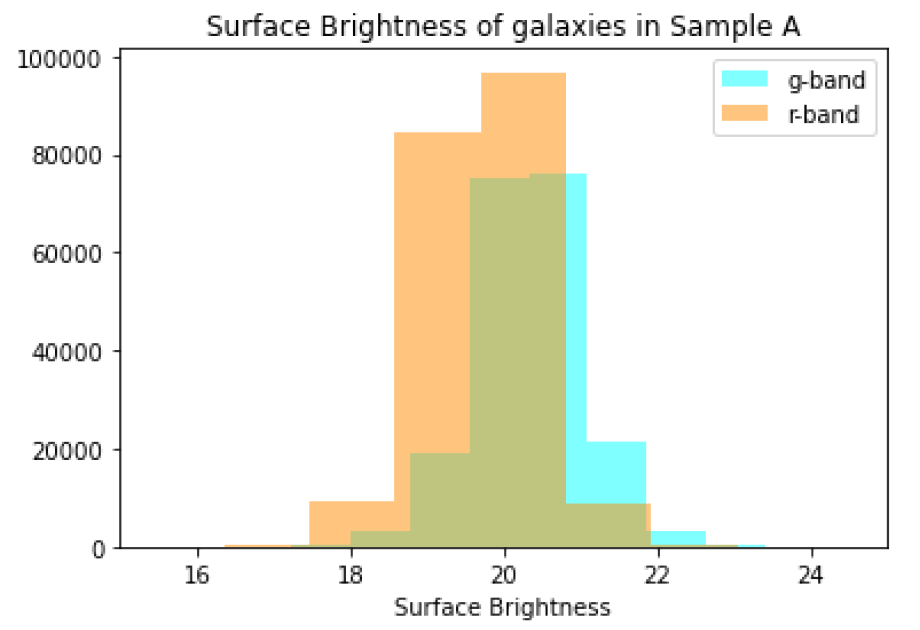
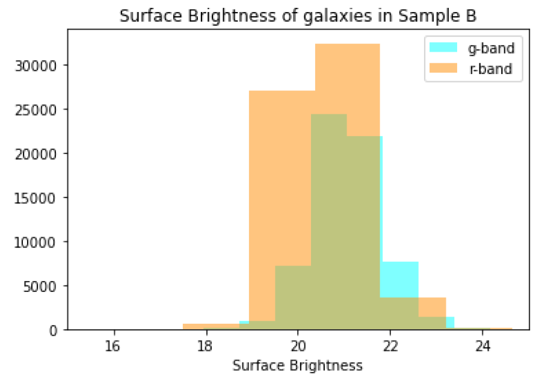

# Galaxy Morphology and Evolution
## Introduction:
Galaxies are the fundamental building blocks of the universe and come in a diverse range of shapes, sizes, and colors. Understanding the properties and evolution of galaxies is crucial for unraveling the mysteries of the cosmos. This project focuses on computing the luminosity, physical size, and surface brightness distribution of early-type (elliptical and lenticular) and late-type (spiral) galaxies using data from the Sloan Digital Sky Survey (SDSS). By analyzing the differences in these properties between galaxy types, we can gain insights into their formation and evolution, shedding light on the complex history of the universe. This project uses the SDSS g-band and r-band from Data Release 7.

## Downloading the data:
Before I begin analyzing galaxy data, I have to first retrieve it from the SDSS database. 

To do so, log into the <a href="[URL](https://casjobs.sdss.org/CasJobs/)">SDSS Database</a>. After logging in, we want to query the database for two samples of galaxies: one sample of Early-Type Galaxies (ETGs) and one sample of Late-Type Galaxies (LTGs). To obtain these samples, I use the following SQL queries. 

```
-- Query for Sample A (Early-type Galaxies)
SELECT TOP 5000
  gal.modelmag_g, gal.devmag_g, gal.expmag_g, gal.devrad_g, gal.exprad_g, gal.expab_g,
  gal.extinction_g, gal.z, gal.modelmag_r, gal.devmag_r, gal.expmag_r, gal.devrad_r, gal.expab_r,
  gal.extinction_r
FROM Galaxy AS gal
JOIN specObj AS sp
ON gal.specObjID=sp.specObjID
WHERE
  gal.petroR90_r/gal.petroR50_r > 2.4
  AND sp.eclass < 0
  AND gal.fracdev_g = 1


-- Query for Sample B (Late-type Galaxies)
SELECT TOP 5000
  gal.modelmag_g, gal.devmag_g, gal.expmag_g, gal.devrad_g, gal.exprad_g, gal.expab_g,
  gal.extinction_g, gal.z, gal.modelmag_r, gal.devmag_r, gal.expmag_r, gal.devrad_r, gal.expab_r,
  gal.extinction_r
FROM Galaxy AS gal
JOIN specObj AS sp
ON gal.specObjID=sp.specObjID
WHERE
  gal.petroR90_r/gal.petroR50_r < 2.2
  AND sp.eclass > 0.05
  AND (gal.fracdev_g BETWEEN 0 and 0.3)
```

After querying the SDSS database with SQL to retrieve galaxy parameters, I visually inspected the following samples of galaxy images using SDSS's SkyServer Explorer:
<h2 style="text-align: center;">Sample A: </h2>

<h2 style="text-align: center;">Sample B: </h2>


Sample A's galaxies appear redder in color, while Sample B's appear more blue. Sample A's galaxies also seem more dense with very little structure, while Sample B's are less dense and some appear to have more structure. This tells us that Sample A most likely consists of early-type galaxies such as elliptical and lenticular galaxies (as expected), while Sample B most likely contains later type galaxies like spiral galaxies (also as expected). 


## K-correction computation 
Next, I compute the K-corrections, which account for the effects of redshift on galaxy brightness, by analyzing flux data from the SDSS database and applying filter responses and reddening corrections to galaxy spectra. This involved interpolating filter data to estimate responses at specific wavelengths, allowing me to visualize and understand the results.

To compute K-corrections, the magnitudes need to be computed first. To do this, I use the .dat files inside of the SPECTRA folder, where each file contains four columns:
- column 1: wavlength [Angstrom]
- column 2: flux corrected for reddening [$$10^{-17} \text{erg/cm}^{2}/\text{s/Å}$$]
- column 3: observed flux [$$10^{-17} \text{erg/cm}^{2}/\text{s/Å}$$]
- column 4: flux error [$$10^{-17} \text{erg/cm}^{2}/\text{s/Å}$$]

Using these spectra, as well as the <a href="[URL](https://classic.sdss.org/dr7/instruments/imager/)">SDSS g-band and r-band filters</a>, I interpolate the filter data so I can estimate the filter response at the observed wavelengths of the spectral data. Then finally, I can compute the observed magnitudes. I use the same technique to calculate the magnitude in the restframe, however, before interpolating, I calculate the restframe wavelength values with this formula: $$\lambda_{rest} = \lambda_{obs} / (1 + z)$$. Once I have the observed magnitudes and the magnitudes in the restframe, I can compute the K-correction, since $$K = m_{obs} - m_{rest}$$.

## K-correction values versus redshift plots:

<style>
.image-grid {
  display: grid;
  grid-template-columns: 1fr 1fr;
  grid-gap: 10px;
}

.image-grid img {
  width: 100%;
  height: auto;
}

.image-grid figcaption {
  text-align: center; /* center the caption */
  font-style: italic; /* italicize the caption */
  font-size: 14px; /* reduce the font size */
  margin-top: 5px; /* add some space between the image and caption */
}
</style>

<div class="image-grid">
  <figure>
    
    <figcaption>De Vaucouleurs Dominated (fracdev = 1) G-Band</figcaption>
  </figure>
  <figure>
    
    <figcaption>De Vaucouleurs Dominated (fracdev = 1) R-Band</figcaption>
  </figure>
  <figure>
    
    <figcaption>Mixed De Vaucouleurs and Exponential Light Distribution (fracdev < 1) G-Band</figcaption>
  </figure>
  <figure>
    
    <figcaption>Mixed De Vaucouleurs and Exponential Light Distribution (fracdev < 1) R-Band</figcaption>
  </figure>
</div>

## Fit interpolating functions for K versus Z to compute the absolute magnitudes
Using sample A  and sample B from the data I downloaded from SDSS, I use my K(z) fits to compute the absolute magnitudes, physical sizes, and the surface brightness of the galaxies.

## Resulting Distributions:


<div class="image-grid">
  <div>
    
  </div>
  <div>
    
  </div>
  <div>
    
  </div>
  <div>
    
  </div>
  <div>
    
  </div>
  <div>
    
  </div>
</div>

The galaxies in Sample A are more luminous than those in Sample B given the Absolute Magnitude distributions. This makes sense when you also look at the physical size distributions of the two samples, since Sample A has more larger galaxies than Sample B. The galaxies in Sample B lean toward a slightly higher surface brightness than those in Sample A, which might seem surprising given the galaxies in Sample A are more luminous overall, however, surface brightness is a measure of luminosity emitted per unit surface area. Thus, since the galaxies in Sample B tend to be physically smaller than those in Sample A, it makes sense that the surface brightness, or luminosity emitted per unit surface area is slightly higher than the larger galaxies in sample A. These differences in luminosity, size, and surface brightness between Sample A and Sample B are consistent with the expected differences between early-type (elliptical and lenticular) and late-type (spiral) galaxies, where early-type galaxies tend to be larger, more luminous, and less dense than late-type galaxies.

